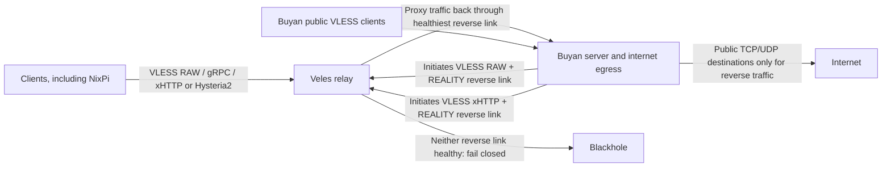
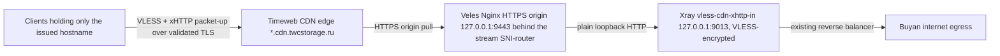

# Proxy architecture (proposed)

This describes the target Xray configuration, **not** the currently deployed configuration. See [the deployment runbook](xray-reverse-deployment.md), [design](superpowers/specs/2026-10-04-xray-proxy-simplification-design.md), and [implementation plan](superpowers/plans/2026-10-04-xray-proxy-simplification.md) before changing a host.

Veles has **one client-facing inbound per protocol** (RAW, gRPC, xHTTP, Hysteria2). No MTProxy, relay SOCKS listener, Veles-direct proxy egress or automatic forward fallback remains. The two reverse connections use the existing `buyan` credential from `secrets.json`, **only** for reverse traffic on Veles; Buyan is removed from the ordinary Veles proxy users. Other client credentials and Buyan's own public proxy service are unchanged.

Xray registers the two reverse outbounds **dynamically** on Veles after Buyan connects. The generated Veles config contains the reverse-marked inbound users, distinct reverse tags, an observatory and a `leastPing` balancer, but no static reverse outbounds. When neither link has a healthy observation, new proxy requests fail closed. Established streams are not replayed during failover.

Veles retains the classic Veles-initiated Buyan target settings as inactive configuration. Setting `roles.xray.relay.egress.via = "forward"` is a **manual rollback** that builds those outbounds and routes through them; `"reverse"` generates none of them. During a staged rollout, the reverse portal can accept Buyan's connections while Veles still routes clients through the forward path. Buyan's reverse ingress has a separate public-only egress policy from its ordinary public-client ingress.

Deployment requires testing the exact Xray binary, both RAW and xHTTP reverse links, TCP and UDP forwarding, Buyan source IP, fail-closed behavior, and denial of private destinations. `nix flake check` alone cannot establish runtime reverse connectivity. No deployment is implied by this document.

## Optional Timeweb CDN ingress (proposed, not deployed)

An additional, entirely optional client path can enter Veles through the Timeweb Cloud CDN instead of dialing Veles's IP directly:

The ingress is gated by `roles.xray.relay.ingress.vless.cdnXhttp` and reuses the existing ordinary Veles users (never the `buyan` reverse-only user) and the existing reverse balancer with its `blocked-out` fail-closed fallback. The Nginx HTTPS origin `sunny-bee-on-the-flower.net.by` serves a static page on `/`, a generic 404 everywhere else, and proxies **only** the dedicated `/vl-cdn` path and its session subpaths to the loopback Xray inbound; all responses carry `no-store`, and expected Xray 4xx replies are intercepted as the same site-style 404. Its SNI-router entry is appended **after** the REALITY entries and can never become the effective fallback backend. Certificate issuance is HTTP-01 on the existing TCP/80 listener; the origin TLS listener is loopback-only on 127.0.0.1:9443 consuming the stream router's PROXY protocol, so no new public TCP listener exists — public 443 remains the stream router.

Buyan and NixPi keep dialing Veles's IP and the existing REALITY transports directly; no existing client moves to the CDN automatically, and Buyan's public inbounds are unchanged. Two limits remain: the origin's apex A record still publicly reveals Veles's IP (only clients who receive just the Timeweb-issued hostname are shielded from it), and a static page or an HTTP status response is **not** proof of CDN-compatible proxying — only the authenticated encrypted client trial in [the deployment runbook](veles-timeweb-cdn-deployment.md) can establish that.
