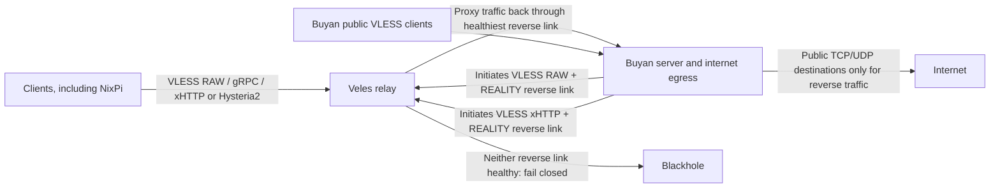

# Proxy architecture (proposed)

This describes the target Xray configuration, **not** the currently deployed configuration. See [the deployment runbook](xray-reverse-deployment.md), [design](superpowers/specs/2026-10-04-xray-proxy-simplification-design.md), and [implementation plan](superpowers/plans/2026-10-04-xray-proxy-simplification.md) before changing a host.

Veles has **one client-facing inbound per protocol** (RAW, gRPC, xHTTP, Hysteria2). No MTProxy, relay SOCKS listener, Veles-direct proxy egress or automatic forward fallback remains. The two reverse connections use the existing `buyan` credential from `secrets.json`, **only** for reverse traffic on Veles; Buyan is removed from the ordinary Veles proxy users. Other client credentials and Buyan's own public proxy service are unchanged.

Xray registers the two reverse outbounds **dynamically** on Veles after Buyan connects. The generated Veles config contains the reverse-marked inbound users, distinct reverse tags, an observatory and a `leastPing` balancer, but no static reverse outbounds. When neither link has a healthy observation, new proxy requests fail closed. Established streams are not replayed during failover.

Veles retains the classic Veles-initiated Buyan target settings as inactive configuration. Setting `roles.xray.relay.egress.via = "forward"` is a **manual rollback** that builds those outbounds and routes through them; `"reverse"` generates none of them. During a staged rollout, the reverse portal can accept Buyan's connections while Veles still routes clients through the forward path. Buyan's reverse ingress has a separate public-only egress policy from its ordinary public-client ingress.

Deployment requires testing the exact Xray binary, both RAW and xHTTP reverse links, TCP and UDP forwarding, Buyan source IP, fail-closed behavior, and denial of private destinations. `nix flake check` alone cannot establish runtime reverse connectivity. No deployment is implied by this document.
